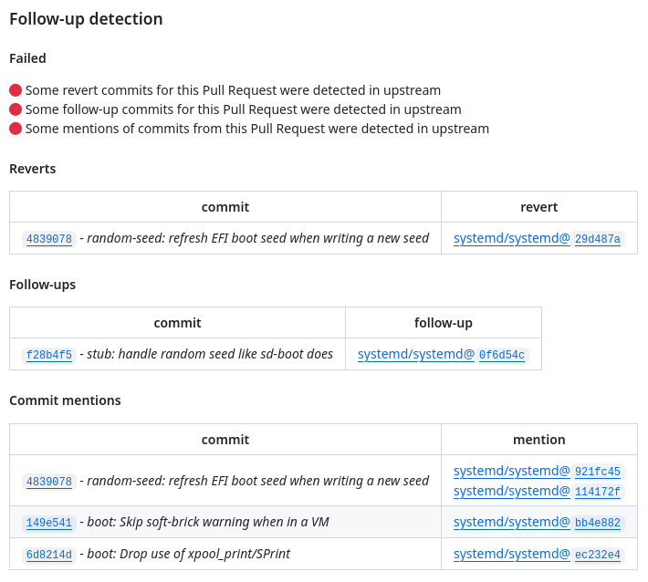

<!-- markdownlint-disable MD033 MD041 -->
<p align="center">
  
  <h1 align="center">Regression Sniffer</h1>
</p>

[![GitHub Marketplace][market-status]][market] [![Lint Code Base][linter-status]][linter] [![Unit Tests][test-status]][test] [![CodeQL][codeql-status]][codeql] [![Check dist/][check-dist-status]][check-dist]

[![codecov][codecov-status]][codecov]

<!-- Status links -->

[market]: https://github.com/marketplace/actions/regression-sniffer
[market-status]: https://img.shields.io/badge/Marketplace-Regression%20Sniffer-blue.svg?colorA=24292e&colorB=0366d6&style=flat&longCache=true&logo=data:image/png;base64,iVBORw0KGgoAAAANSUhEUgAAAA4AAAAOCAYAAAAfSC3RAAAABHNCSVQICAgIfAhkiAAAAAlwSFlzAAAM6wAADOsB5dZE0gAAABl0RVh0U29mdHdhcmUAd3d3Lmlua3NjYXBlLm9yZ5vuPBoAAAERSURBVCiRhZG/SsMxFEZPfsVJ61jbxaF0cRQRcRJ9hlYn30IHN/+9iquDCOIsblIrOjqKgy5aKoJQj4O3EEtbPwhJbr6Te28CmdSKeqzeqr0YbfVIrTBKakvtOl5dtTkK+v4HfA9PEyBFCY9AGVgCBLaBp1jPAyfAJ/AAdIEG0dNAiyP7+K1qIfMdonZic6+WJoBJvQlvuwDqcXadUuqPA1NKAlexbRTAIMvMOCjTbMwl1LtI/6KWJ5Q6rT6Ht1MA58AX8Apcqqt5r2qhrgAXQC3CZ6i1+KMd9TRu3MvA3aH/fFPnBodb6oe6HM8+lYHrGdRXW8M9bMZtPXUji69lmf5Cmamq7quNLFZXD9Rq7v0Bpc1o/tp0fisAAAAASUVORK5CYII=

[linter]: https://github.com/redhat-plumbers-in-action/regression-sniffer/actions/workflows/lint.yml
[linter-status]: https://github.com/redhat-plumbers-in-action/regression-sniffer/actions/workflows/lint.yml/badge.svg

[test]: https://github.com/redhat-plumbers-in-action/regression-sniffer/actions/workflows/test.yml
[test-status]: https://github.com/redhat-plumbers-in-action/regression-sniffer/actions/workflows/test.yml/badge.svg

[codeql]: https://github.com/redhat-plumbers-in-action/regression-sniffer/actions/workflows/codeql-analysis.yml
[codeql-status]: https://github.com/redhat-plumbers-in-action/regression-sniffer/actions/workflows/codeql-analysis.yml/badge.svg

[check-dist]: https://github.com/redhat-plumbers-in-action/regression-sniffer/actions/workflows/check-dist.yml
[check-dist-status]: https://github.com/redhat-plumbers-in-action/regression-sniffer/actions/workflows/check-dist.yml/badge.svg

[codecov]: https://codecov.io/gh/redhat-plumbers-in-action/regression-sniffer
[codecov-status]: https://codecov.io/gh/redhat-plumbers-in-action/regression-sniffer/branch/main/graph/badge.svg

<!-- -->

## Features

<picture>
  <source media="(prefers-color-scheme: dark)" srcset="docs/images/status-dark.png">
  
</picture>

## Usage

To set up Regression Sniffer, we need three files:

* Workflow that captures Pull Request metadata (number and commit metadata) and uploads this data as an artifact
* Workflow that runs on `workflow-run` trigger, downloads artifact, and runs `regression-sniffer` GitHub Action
* And we need to set up `regression-sniffer.yml` configuration file

> [!NOTE]
>
> Setup is complicated due to GitHub [permissions on `GITHUB_TOKEN`](https://docs.github.com/en/actions/security-guides/automatic-token-authentication#permissions-for-the-github_token). When used in workflow executed from fork it has `read-only` permissions. By using the `workflow-run` trigger we are able to [safely overcome this limitation](https://securitylab.github.com/research/github-actions-preventing-pwn-requests/) and it allows us to set labels and status checks on Pull Requests.

```yml
name: Gather Pull Request Metadata
on:
  pull_request:
    types: [ opened, reopened, synchronize ]
    branches: [ main ]

permissions:
  contents: read

jobs:
  gather-metadata:
    runs-on: ubuntu-latest

    steps:
      - name: Repository checkout
        uses: actions/checkout@v3

      - id: Metadata
        name: Gather Pull Request Metadata
        uses: redhat-plumbers-in-action/gather-pull-request-metadata@v1

      - name: Upload artifact with gathered metadata
        uses: actions/upload-artifact@v3
        with:
          name: pr-metadata
          path: ${{ steps.Metadata.outputs.metadata-file }}
```

```yml
name: Regression Sniffer
on:
  workflow_run:
    workflows: [ Gather Pull Request Metadata ]
    types:
      - completed

permissions:
  contents: read

jobs:
  download-metadata:
    if: >
      github.event.workflow_run.event == 'pull_request' &&
      github.event.workflow_run.conclusion == 'success'
    runs-on: ubuntu-latest

    outputs:
      pr-metadata: ${{ steps.Artifact.outputs.pr-metadata-json }}

    steps:
      - id: Artifact
        name: Download Artifact
        uses: redhat-plumbers-in-action/download-artifact@v1
        with:
          name: pr-metadata

  regression-sniffer:
    needs: [ download-metadata ]
    runs-on: ubuntu-latest

    permissions:
      # required for setting labels
      pull-requests: write

    steps:
      - name: Regression Sniffer
        uses: redhat-plumbers-in-action/regression-sniffer@v1
        with:
          pr-metadata: ${{ needs.download-metadata.outputs.pr-metadata }}
          token: ${{ secrets.GITHUB_TOKEN }}
```

Lastly, we need to create a configuration file `.github/regression-sniffer.yml`:

```yml
upstream: systemd/systemd
```

## Configuration options

Action currently accepts the following options:

```yml
# ...

- uses: redhat-plumbers-in-action/regression-sniffer@v1
  with:
    check-mentions:   <boolean>
    check-follow-up:  <boolean>
    check-revert:     <boolean>
    pr-metadata:      <pr-metadata.json>
    config-path:      <path to config file>
    status-title:     <status title>
    token:            <GitHub token or PAT>

# ...
```

### check-mentions

Check if Pull Request has some commit mentions related to cherri-picked commits in upstream available.

* default value: `true`
* requirements: `optional`

### check-follow-up

Check if Pull Request has some follow-up commit related to cherri-picked commits in upstream available.

* default value: `true`
* requirements: `optional`

### check-revert

Check if Pull Request has some cherri-picked commits from upstream that were later reverted.

* default value: `true`
* requirements: `optional`

### pr-metadata

Stringified JSON Pull Request metadata provided by GitHub Action [`redhat-plumbers-in-action/gather-pull-request-metadata`](https://github.com/redhat-plumbers-in-action/gather-pull-request-metadata).

Pull Request metadata has the following format: [metadata format](https://github.com/redhat-plumbers-in-action/gather-pull-request-metadata#metadata)

* default value: `undefined`
* requirements: `required`

### config-path

Path to configuration file. Configuration file format is described in: [Config section](#config).

* default value: `.github/regression-sniffer.yml`
* requirements: `optional`

### status-title

Optional `H3` title of status message.

* default value: `Pull Request validation`
* requirements: `optional`

### token

GitHub token or PAT is used for creating labels on Pull Request.

```yml
# required permission
permissions:
  pull-requests: write
```

* default value: `undefined`
* requirements: `required`
* recomended value: `secrets.GITHUB_TOKEN`

## Outputs

### status

Message with status of Pull Request validation.

## Config

Action is configured using special config file: .github/regression-sniffer.yml. The structure needs to be as follows:

```yml
upstream: systemd/systemd
labels:
  follow-up: pr/follow-up
  revert: pr/revert
  mention: pr/mention
  waive: follow-up-waived
filters:
  follow-up:
    - 'follow-?up *(|:|-|for|to) *(https:\\/\\/github\\.com\\/systemd\\/systemd\\/commit\\/)?(%{sha}%)'
  revert:
    - '(This)? *reverts? *(commit)? *(|:|-) *(https:\\/\\/github\\.com\\/systemd\\/systemd\\/commit\\/)?(%{sha}%)'
  mention:
    - '(https:\\/\\/github\\.com\\/systemd\\/systemd\\/commit\\/)?(%{sha}%)'
```

### upstream

Name of the upstream repository in the format: `owner/repo`. Currently only one upstream repository is supported. Also it is currently limited to public GitHub repositories.

* default value: `undefined`
* requirements: `required`

### labels

Configuration of labels used for marking Pull Requests. Supported labels are:

* `follow-up` - label used for marking Pull Requests with follow-up commits detected
  * default value: `pr/follow-up`
* `revert` - label used for marking Pull Requests with reverted commits detected
  * default value: `pr/revert`
* `mention` - label used for marking Pull Requests with mentioned commits detected
  * default value: `pr/mention`
* `waive` - label used for waiving results reported by Regression Sniffer
  * default value: `follow-up-waived`

`labels` section is optional and if not provided, default values will be used.

### filters

Configuration of filters used for detecting commit mentions, follow-up and revert commits. Each filter is a list of regular expressions. Regular expressions can contain special placeholders:

* `%{sha}%` - placeholder for commit SHA, it will be replaced with actual commit SHA at action runtime

#### follow-up

List of regular expressions used for detecting follow-up commits. Each regular expression is a string.

* default value: `follow-?up *(|:|-|for|to) *(https:\\/\\/github\\.com\\/systemd\\/systemd\\/commit\\/)?(%{sha}%)`
* requirements: `optional`

#### revert

List of regular expressions used for detecting revert commits. Each regular expression is a string.

* default value: `(This)? *reverts? *(commit)? *(|:|-) *(https:\\/\\/github\\.com\\/systemd\\/systemd\\/commit\\/)?(%{sha}%)`
* requirements: `optional`

#### mention

List of regular expressions used for detecting commit mentions. Each regular expression is a string.

* default value: `(https:\\/\\/github\\.com\\/systemd\\/systemd\\/commit\\/)?(%{sha}%)`
* requirements: `optional`
